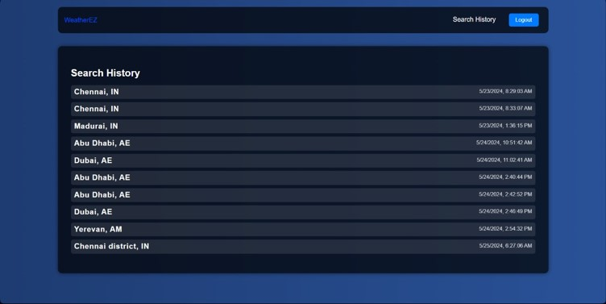
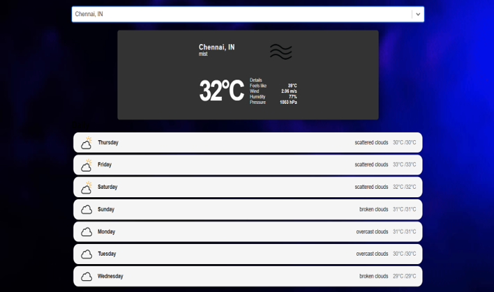
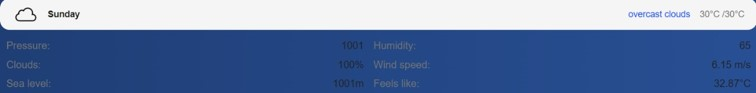
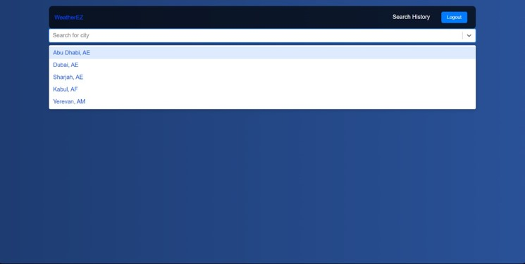
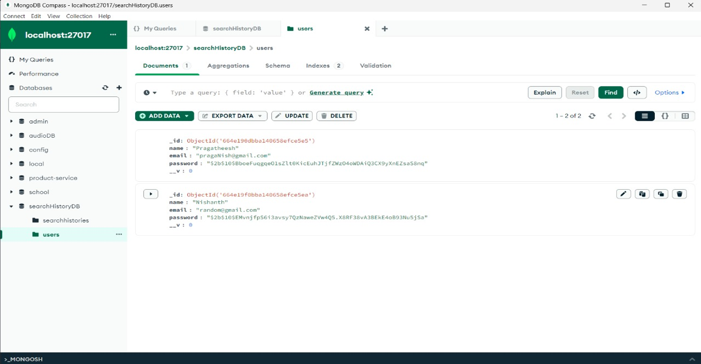

## Weather Forecast Web App
A responsive web application that provides real-time weather updates and 7-day forecasts based on user location. Includes user authentication, personalized dashboard, and dynamic weather data using the OpenWeatherMap API.

### Tech Stack
Frontend: React.js

Backend: Node.js, Express.js

Database: MongoDB

API: OpenWeatherMap

### Features
User sign-up/login and session handling

Location-based current weather and forecast

Clean and mobile-friendly UI

Error handling for invalid inputs and API issues

## Screenshots

#### Login

#### Search History

#### 7-Day Forecast

#### Dynamic Weather Data

#### Auto-Complete

#### Storing in MongoDB

